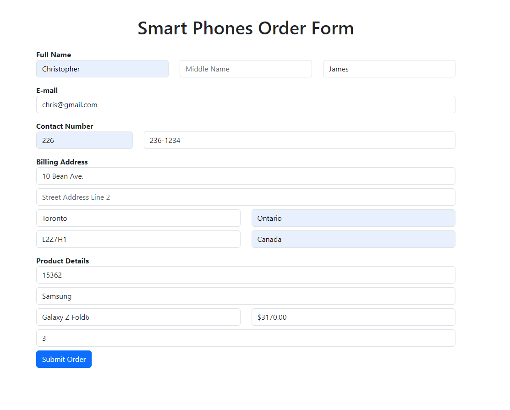

# Spring Web MVC Smartphone Order Application

This project is a web application for ordering smartphones, built using Spring Boot and Thymeleaf. It demonstrates form handling, client-side and server-side validation, and dynamic content loading using JavaScript.

## Features

- User-friendly order form for smartphone purchases
- Dynamic phone brand and model selection
- Real-time price updates based on selected phone model
- Form validation
- Order confirmation page with detailed summary

## Technologies Used

- Java 17
- Spring Boot 3.3.3
- Thymeleaf
- Bootstrap 5.3.3
- JavaScript (ES6+)
- Maven

## Usage

1. Fill out the order form with your personal details and phone selection.
2. The phone brand and model dropdowns are dynamically populated.
3. The phone price updates automatically based on your selection.
4. Submit the form to see the order confirmation page.

## Screenshots

## License

This project is licensed under the MIT License - see the [LICENSE](LICENSE) file for details.